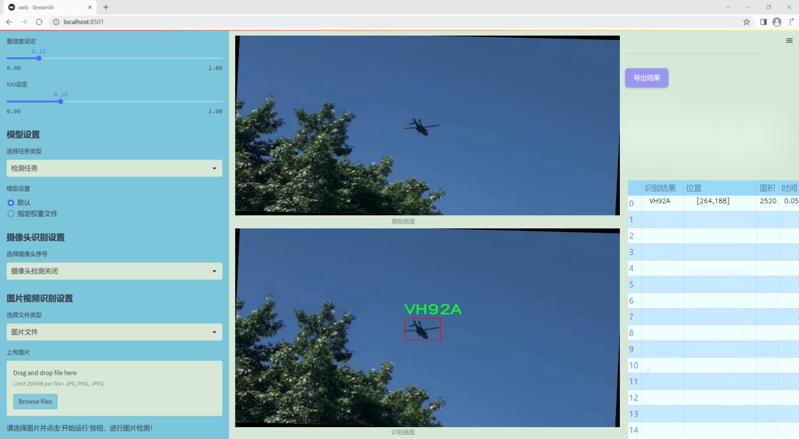
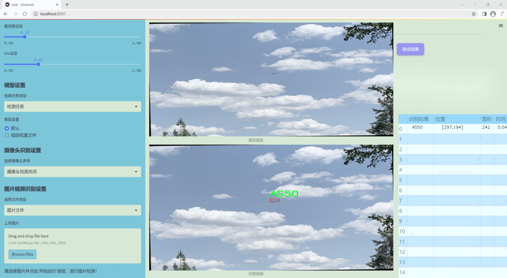
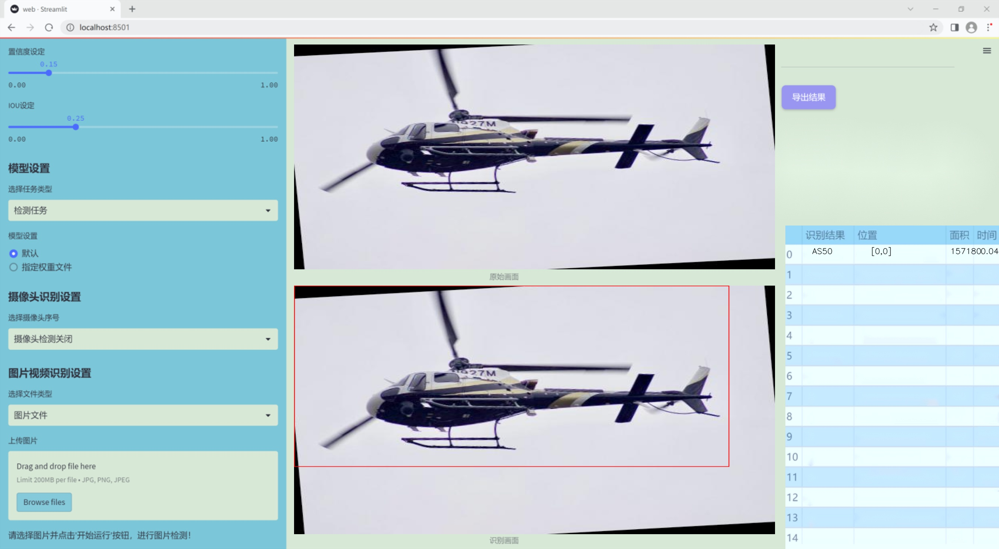
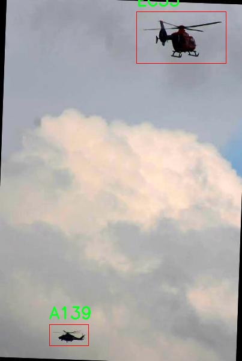
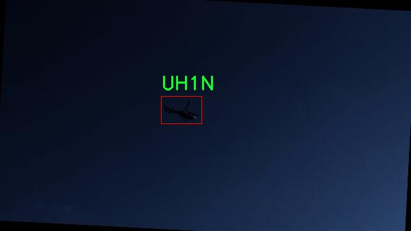
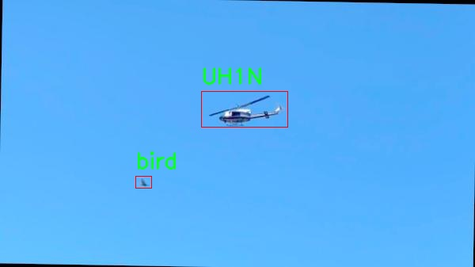
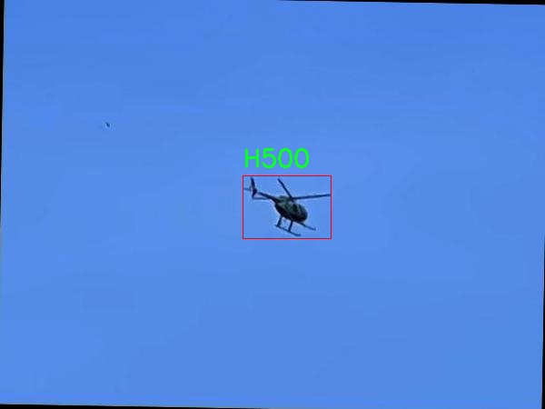
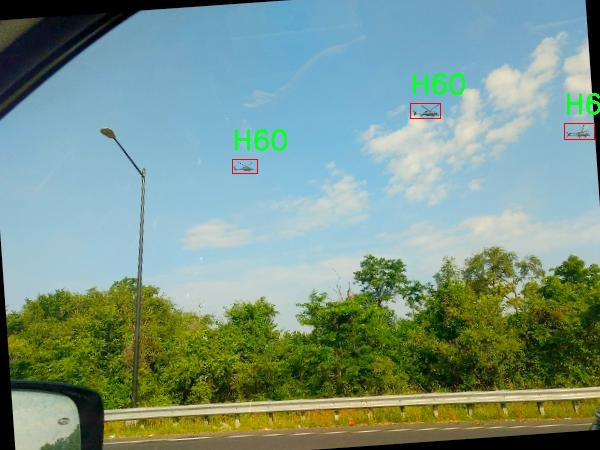

# 改进yolo11-EfficientRepBiPAN等200+全套创新点大全：直升机战机类型识别目标检测系统源码＆数据集全套

### 1.图片效果展示







##### 项目来源 **[人工智能促进会 2024.10.30](https://kdocs.cn/l/cszuIiCKVNis)**

注意：由于项目一直在更新迭代，上面“1.图片效果展示”和“2.视频效果展示”展示的系统图片或者视频可能为老版本，新版本在老版本的基础上升级如下：（实际效果以升级的新版本为准）

  （1）适配了YOLOV11的“目标检测”模型和“实例分割”模型，通过加载相应的权重（.pt）文件即可自适应加载模型。

  （2）支持“图片识别”、“视频识别”、“摄像头实时识别”三种识别模式。

  （3）支持“图片识别”、“视频识别”、“摄像头实时识别”三种识别结果保存导出，解决手动导出（容易卡顿出现爆内存）存在的问题，识别完自动保存结果并导出到tempDir中。

  （4）支持Web前端系统中的标题、背景图等自定义修改。

  另外本项目提供训练的数据集和训练教程,暂不提供权重文件（best.pt）,需要您按照教程进行训练后实现图片演示和Web前端界面演示的效果。

### 2.视频效果展示

[2.1 视频效果展示](https://www.bilibili.com/video/BV1VCSLYYEVp/)

### 3.背景

研究背景与意义

随着现代战争的日益复杂化，空中作战力量的有效识别与分类变得愈发重要。直升机作为一种灵活多变的空中作战平台，其在战场上的作用不可小觑。为了提升对直升机及其他空中目标的识别能力，基于深度学习的目标检测技术应运而生。其中，YOLO（You Only Look Once）系列模型因其高效的实时检测能力而备受关注。YOLOv11作为该系列的最新版本，具备更强的特征提取能力和更快的推理速度，适合在复杂的战场环境中进行直升机类型的识别。

本研究旨在基于改进的YOLOv11模型，构建一个高效的直升机战机类型识别目标检测系统。该系统将利用“Helicopters-of-DC”数据集，该数据集包含5500张图像，涵盖了多种直升机型号，包括A139、AS50、CH47等共计3类目标。通过对这些图像的深入分析与处理，系统能够在多种环境下准确识别不同类型的直升机及其他空中目标，如气球、鸟类和飞机等。这不仅为军事侦察提供了技术支持，也为无人机等新型空中作战平台的应用提供了数据基础。

此外，随着人工智能技术的快速发展，基于YOLOv11的目标检测系统在实际应用中的潜力巨大。其不仅可以应用于军事领域，还可以扩展到民用航空安全、交通监控等多个领域。通过本研究的实施，将推动目标检测技术的进一步发展，为相关领域的研究提供新的思路和方法。综上所述，本项目不仅具有重要的学术价值，也具备广泛的应用前景。

### 4.数据集信息展示

##### 4.1 本项目数据集详细数据（类别数＆类别名）

train: ../train/images
val: ../valid/images
test: ../test/images

nc: 24
names: ['A139', 'AS50', 'B06', 'B412', 'B429', 'CH47', 'EC35', 'EC45', 'H500', 'H60', 'H60-Aux Fuel Tanks', 'MD52', 'MH65', 'R66', 'S76', 'UH1N', 'UH72', 'V22', 'VH3D', 'VH60N', 'VH92A', 'bird', 'i', 'plane']

roboflow:
  workspace: helicoptersofdc
  project: helicopters-of-dc-ghwuq
  version: 3
  license: BY-NC-SA 4.0
  url: https://universe.roboflow.com/helicoptersofdc/helicopters-of-dc-ghwuq/dataset/3


该项目为【目标检测】数据集，请在【训练教程和Web端加载模型教程（第三步）】这一步的时候按照【目标检测】部分的教程来训练

##### 4.2 本项目数据集信息介绍

本项目数据集信息介绍

本项目所使用的数据集名为“Helicopters-of-DC”，旨在为改进YOLOv11的直升机战机类型识别目标检测系统提供支持。该数据集包含丰富的直升机及相关飞行器图像，经过精心标注，以确保模型训练的准确性和有效性。数据集分为三个主要部分：训练集、验证集和测试集，分别存放于指定的路径下。训练集包含大量的图像数据，供模型学习和优化；验证集用于在训练过程中监测模型的性能；测试集则用于最终评估模型的泛化能力。

该数据集涵盖了24个类别，具体包括多种直升机型号，如A139、AS50、B06、B412、B429、CH47等，以及一些其他飞行器，如鸟类和飞机。这些类别的选择不仅考虑了直升机的多样性，还包括了一些可能在训练和测试过程中出现的干扰目标，以增强模型的鲁棒性。通过对这些类别的精确标注，数据集为目标检测任务提供了丰富的样本，帮助模型更好地识别和分类不同类型的直升机。

数据集的设计遵循了BY-NC-SA 4.0的许可协议，确保了其在学术研究和开发中的合理使用。数据集的版本为3，反映了其在不断更新和完善的过程中所积累的经验和反馈。通过利用“Helicopters-of-DC”数据集，研究人员能够有效地训练和评估YOLOv11模型，从而提升直升机战机类型识别的准确性，为相关领域的应用提供更为强大的技术支持。











### 5.全套项目环境部署视频教程（零基础手把手教学）

[5.1 所需软件PyCharm和Anaconda安装教程（第一步）](https://www.bilibili.com/video/BV1BoC1YCEKi/?spm_id_from=333.999.0.0&vd_source=bc9aec86d164b67a7004b996143742dc)


[5.2 安装Python虚拟环境创建和依赖库安装视频教程（第二步）](https://www.bilibili.com/video/BV1ZoC1YCEBw?spm_id_from=333.788.videopod.sections&vd_source=bc9aec86d164b67a7004b996143742dc)

### 6.改进YOLOv11训练教程和Web_UI前端加载模型教程（零基础手把手教学）

[6.1 改进YOLOv11训练教程和Web_UI前端加载模型教程（第三步）](https://www.bilibili.com/video/BV1BoC1YCEhR?spm_id_from=333.788.videopod.sections&vd_source=bc9aec86d164b67a7004b996143742dc)


按照上面的训练视频教程链接加载项目提供的数据集，运行train.py即可开始训练



     Epoch   gpu_mem       box       obj       cls    labels  img_size
     1/200     20.8G   0.01576   0.01955  0.007536        22      1280: 100%|██████████| 849/849 [14:42<00:00,  1.04s/it]
               Class     Images     Labels          P          R     mAP@.5 mAP@.5:.95: 100%|██████████| 213/213 [01:14<00:00,  2.87it/s]
                 all       3395      17314      0.994      0.957      0.0957      0.0843

     Epoch   gpu_mem       box       obj       cls    labels  img_size
     2/200     20.8G   0.01578   0.01923  0.007006        22      1280: 100%|██████████| 849/849 [14:44<00:00,  1.04s/it]
               Class     Images     Labels          P          R     mAP@.5 mAP@.5:.95: 100%|██████████| 213/213 [01:12<00:00,  2.95it/s]
                 all       3395      17314      0.996      0.956      0.0957      0.0845

     Epoch   gpu_mem       box       obj       cls    labels  img_size
     3/200     20.8G   0.01561    0.0191  0.006895        27      1280: 100%|██████████| 849/849 [10:56<00:00,  1.29it/s]
               Class     Images     Labels          P          R     mAP@.5 mAP@.5:.95: 100%|███████   | 187/213 [00:52<00:00,  4.04it/s]
                 all       3395      17314      0.996      0.957      0.0957      0.0845


###### [项目数据集下载链接](https://kdocs.cn/l/cszuIiCKVNis)

### 7.原始YOLOv11算法讲解


##### YOLOv11三大损失函数

YOLOv11（You Only Look Once）是一种流行的目标检测算法，其损失函数设计用于同时优化分类和定位任务。YOLO的损失函数通常包括几个部分：
**分类损失、定位损失（边界框回归损失）和置信度损失** 。其中，

  1. box_loss（边界框回归损失）是用于优化预测边界框与真实边界框之间的差异的部分。

  2. cls_loss（分类损失）是用于优化模型对目标类别的预测准确性的部分。分类损失确保模型能够正确地识别出图像中的对象属于哪个类别。

  3. dfl_loss（Distribution Focal Loss）是YOLO系列中的一种损失函数，特别是在一些改进版本如YOLOv5和YOLOv7中被引入。它的主要目的是解决目标检测中的类别不平衡问题，并提高模型在处理小目标和困难样本时的性能。

##### 边界框回归损失详解

box_loss（边界框回归损失）是用于优化预测边界框与真实边界框之间的差异的部分。


##### box_loss 的具体意义


##### 为什么需要 box_loss

  * 精确定位：通过最小化中心点坐标损失和宽高损失，模型能够更准确地预测目标的位置和大小。
  * 平衡不同类型的目标：使用平方根来处理宽高损失，可以更好地平衡不同大小的目标，确保小目标也能得到足够的关注。
  * 稳定训练：适当的损失函数设计有助于模型的稳定训练，避免梯度爆炸或消失等问题。

##### 分类损失详解

在YOLO（You Only Look
Once）目标检测算法中，cls_loss（分类损失）是用于优化模型对目标类别的预测准确性的部分。分类损失确保模型能够正确地识别出图像中的对象属于哪个类别。下面是关于cls_loss的详细解读：

##### 分类损失 (cls_loss) 的具体意义

  
分类损失通常使用交叉熵损失（Cross-Entropy
Loss）来计算。交叉熵损失衡量的是模型预测的概率分布与真实标签之间的差异。在YOLO中，分类损失的具体形式如下：


##### 为什么需要 cls_loss

  * 类别识别：cls_loss 确保模型能够正确识别出图像中的目标属于哪个类别。这对于目标检测任务至关重要，因为不仅需要知道目标的位置，还需要知道目标的类型。

  * 多类别支持：通过最小化分类损失，模型可以处理多个类别的目标检测任务。例如，在道路缺陷检测中，可能需要识别裂缝、坑洞、路面破损等多种类型的缺陷。

  * 提高准确性：分类损失有助于提高模型的分类准确性，从而提升整体检测性能。通过优化分类损失，模型可以更好地学习不同类别之间的特征差异。

##### 分布损失详解

`dfl_loss`（Distribution Focal
Loss）是YOLO系列中的一种损失函数，特别是在一些改进版本如YOLOv5和YOLOv7中被引入。它的主要目的是解决目标检测中的类别不平衡问题，并提高模型在处理小目标和困难样本时的性能。下面是对`dfl_loss`的详细解读：

##### DFL Loss 的背景

在目标检测任务中，类别不平衡是一个常见的问题。某些类别的样本数量可能远远多于其他类别，这会导致模型在训练过程中对常见类别的学习效果较好，而对罕见类别的学习效果较差。此外，小目标和困难样本的检测也是一个挑战，因为这些目标通常具有较少的特征信息，容易被忽略或误分类。

为了应对这些问题，研究者们提出了多种改进方法，其中之一就是`dfl_loss`。`dfl_loss`通过引入分布焦点损失来增强模型对困难样本的关注，并改善类别不平衡问题。

##### DFL Loss 的定义

DFL Loss
通常与传统的交叉熵损失结合使用，以增强模型对困难样本的学习能力。其核心思想是通过对每个类别的预测概率进行加权，使得模型更加关注那些难以正确分类的样本。

DFL Loss 的公式可以表示为：


##### DFL Loss 的具体意义**

  * **类别不平衡：** 通过引入平衡因子 α，DFL Loss 可以更好地处理类别不平衡问题。对于少数类别的样本，可以通过增加其权重来提升其重要性，从而提高模型对这些类别的检测性能。
  *  **困难样本：** 通过聚焦参数 γ，DFL Loss 可以让模型更加关注那些难以正确分类的样本。当 
  * γ 较大时，模型会对那些预测概率较低的样本给予更多的关注，从而提高这些样本的分类准确性。
  *  **提高整体性能** ：DFL Loss 结合了传统交叉熵损失的优势，并通过加权机制增强了模型对困难样本的学习能力，从而提高了整体的检测性能。


### 8.200+种全套改进YOLOV11创新点原理讲解

#### 8.1 200+种全套改进YOLOV11创新点原理讲解大全

由于篇幅限制，每个创新点的具体原理讲解就不全部展开，具体见下列网址中的改进模块对应项目的技术原理博客网址【Blog】（创新点均为模块化搭建，原理适配YOLOv5~YOLOv11等各种版本）

[改进模块技术原理博客【Blog】网址链接](https://gitee.com/qunmasj/good)


#### 8.2 精选部分改进YOLOV11创新点原理讲解

###### 这里节选部分改进创新点展开原理讲解(完整的改进原理见上图和[改进模块技术原理博客链接](https://gitee.com/qunmasj/good)【如果此小节的图加载失败可以通过CSDN或者Github搜索该博客的标题访问原始博客，原始博客图片显示正常】

### RT-DETR骨干网络HGNetv2简介
#### RT-DETR横空出世
前几天被百度的RT-DETR刷屏，参考该博客提出的目标检测新范式对原始DETR的网络结构进行了调整和优化，以提高计算速度和减小模型大小。这包括使用更轻量级的基础网络和调整Transformer结构。并且，摒弃了nms处理的detr结构与传统的物体检测方法相比，不仅训练是端到端的，检测也能端到端，这意味着整个网络在训练过程中一起进行优化，推理过程不需要昂贵的后处理代价，这有助于提高模型的泛化能力和性能。


当然，人们对RT-DETR之所以产生浓厚的兴趣，我觉得大概率还是对YOLO系列审美疲劳了，就算是出到了YOLO10086，我还是只想用YOLOv11和YOLOv11的框架来魔改做业务。。

#### 初识HGNet
看到RT-DETR的性能指标，发现指标最好的两个模型backbone都是用的HGNetv2，毫无疑问，和当时的picodet一样，骨干都是使用百度自家的网络。初识HGNet的时候，当时是参加了第四届百度网盘图像处理大赛，文档图像方向识别专题赛道，简单来说，就是使用分类网络对一些文档截图或者图片进行方向角度分类。


当时的方案并没有那么快定型，通常是打榜过程发现哪个网络性能好就使用哪个网络做魔改，而且木有显卡，只能蹭Ai Studio的平台，不过v100一天8小时的实验时间有点短，这也注定了大模型用不了。 

流水的模型，铁打的炼丹人，最后发现HGNet-tiny各方面指标都很符合我们的预期，后面就一直围绕它魔改。当然，比赛打榜是目的，学习才是享受过程，当时看到效果还可以，便开始折腾起了HGNet的网络架构，我们可以看到，PP-HGNet 针对 GPU 设备，对目前 GPU 友好的网络做了分析和归纳，尽可能多的使用 3x3 标准卷积（计算密度最高），PP-HGNet是由多个HG-Block组成，细节如下：


ConvBNAct是啥？简单聊一聊，就是Conv+BN+Act，CV Man应该最熟悉不过了：
```python
class ConvBNAct(TheseusLayer):
    def __init__(self,
                 in_channels,
                 out_channels,
                 kernel_size,
                 stride,
                 groups=1,
                 use_act=True):
        super().__init__()
        self.use_act = use_act
        self.conv = Conv2D(
            in_channels,
            out_channels,
            kernel_size,
            stride,
            padding=(kernel_size - 1) // 2,
            groups=groups,
            bias_attr=False)
        self.bn = BatchNorm2D(
            out_channels,
            weight_attr=ParamAttr(regularizer=L2Decay(0.0)),
            bias_attr=ParamAttr(regularizer=L2Decay(0.0)))
        if self.use_act:
            self.act = ReLU()
 
    def forward(self, x):
        x = self.conv(x)
        x = self.bn(x)
        if self.use_act:
            x = self.act(x)
        return x 
```
且标准卷积的数量随层数深度增加而增多，从而得到一个有利于 GPU 推理的骨干网络，同样速度下，精度也超越其他 CNN ，性价比也优于ViT-base模型。


另外，我们可以看到：

PP-HGNet 的第一层由channel为96的Stem模块构成，目的是为了减少参数量和计算量。PP-HGNet

Tiny的整体结构由四个HG Stage构成，而每个HG Stage主要由包含大量标准卷积的HG Block构成。

PP-HGNet的第三到第五层使用了使用了可学习的下采样层（LDS Layer），该层group为输入通道数，可达到降参降计算量的作用，且Tiny模型仅包含三个LDS Layer，并不会对GPU的利用率造成较大影响.

PP-HGNet的激活函数为Relu，常数级操作可保证该模型在硬件上的推理速度。

### 9.系统功能展示

图9.1.系统支持检测结果表格显示

  图9.2.系统支持置信度和IOU阈值手动调节

  图9.3.系统支持自定义加载权重文件best.pt(需要你通过步骤5中训练获得)

  图9.4.系统支持摄像头实时识别

  图9.5.系统支持图片识别

  图9.6.系统支持视频识别

  图9.7.系统支持识别结果文件自动保存

  图9.8.系统支持Excel导出检测结果数据


### 10. YOLOv11核心改进源码讲解

#### 10.1 metaformer.py

以下是对代码中最核心部分的分析和详细注释。保留了关键的类和方法，去掉了一些不必要的部分。

```python
import torch
import torch.nn as nn
import torch.nn.functional as F
from functools import partial
from timm.layers import DropPath

class Scale(nn.Module):
    """
    按元素乘法缩放向量。
    """
    def __init__(self, dim, init_value=1.0, trainable=True):
        super().__init__()
        # 初始化可训练的缩放参数
        self.scale = nn.Parameter(init_value * torch.ones(dim), requires_grad=trainable)

    def forward(self, x):
        # 将输入乘以缩放参数
        return x * self.scale

class MF_Attention(nn.Module):
    """
    Transformer中的自注意力机制实现。
    """
    def __init__(self, dim, head_dim=32, num_heads=None, qkv_bias=False,
                 attn_drop=0., proj_drop=0., proj_bias=False):
        super().__init__()
        self.head_dim = head_dim
        self.scale = head_dim ** -0.5  # 缩放因子

        # 计算头的数量
        self.num_heads = num_heads if num_heads else dim // head_dim
        if self.num_heads == 0:
            self.num_heads = 1
        
        self.attention_dim = self.num_heads * self.head_dim

        # 定义线性层用于生成Q、K、V
        self.qkv = nn.Linear(dim, self.attention_dim * 3, bias=qkv_bias)
        self.attn_drop = nn.Dropout(attn_drop)  # 注意力的dropout
        self.proj = nn.Linear(self.attention_dim, dim, bias=proj_bias)  # 投影层
        self.proj_drop = nn.Dropout(proj_drop)  # 投影后的dropout

    def forward(self, x):
        B, H, W, C = x.shape  # B: batch size, H: height, W: width, C: channels
        N = H * W  # 总的token数量
        # 计算Q、K、V
        qkv = self.qkv(x).reshape(B, N, 3, self.num_heads, self.head_dim).permute(2, 0, 3, 1, 4)
        q, k, v = qkv.unbind(0)  # 分离Q、K、V

        # 计算注意力
        attn = (q @ k.transpose(-2, -1)) * self.scale  # 计算注意力分数
        attn = attn.softmax(dim=-1)  # softmax归一化
        attn = self.attn_drop(attn)  # 应用dropout

        # 计算输出
        x = (attn @ v).transpose(1, 2).reshape(B, H, W, self.attention_dim)
        x = self.proj(x)  # 投影回原始维度
        x = self.proj_drop(x)  # 应用dropout
        return x

class Mlp(nn.Module):
    """
    用于MetaFormer模型的多层感知机（MLP）。
    """
    def __init__(self, dim, mlp_ratio=4, out_features=None, act_layer=nn.GELU, drop=0., bias=False):
        super().__init__()
        in_features = dim
        out_features = out_features or in_features
        hidden_features = int(mlp_ratio * in_features)

        # 定义MLP的层
        self.fc1 = nn.Linear(in_features, hidden_features, bias=bias)
        self.act = act_layer()  # 激活函数
        self.drop1 = nn.Dropout(drop)  # dropout层
        self.fc2 = nn.Linear(hidden_features, out_features, bias=bias)
        self.drop2 = nn.Dropout(drop)  # dropout层

    def forward(self, x):
        # 前向传播
        x = self.fc1(x)
        x = self.act(x)
        x = self.drop1(x)
        x = self.fc2(x)
        x = self.drop2(x)
        return x

class MetaFormerBlock(nn.Module):
    """
    一个MetaFormer块的实现。
    """
    def __init__(self, dim, token_mixer=nn.Identity, mlp=Mlp,
                 norm_layer=partial(Scale, eps=1e-6), drop=0., drop_path=0.):
        super().__init__()

        self.norm1 = norm_layer(dim)  # 归一化层
        self.token_mixer = token_mixer(dim=dim, drop=drop)  # token混合层
        self.drop_path1 = DropPath(drop_path) if drop_path > 0. else nn.Identity()  # 随机丢弃路径
        self.layer_scale1 = Scale(dim=dim)  # 层缩放
        self.res_scale1 = Scale(dim=dim)  # 残差缩放

        self.norm2 = norm_layer(dim)  # 第二个归一化层
        self.mlp = mlp(dim=dim, drop=drop)  # MLP层
        self.drop_path2 = DropPath(drop_path) if drop_path > 0. else nn.Identity()  # 随机丢弃路径
        self.layer_scale2 = Scale(dim=dim)  # 层缩放
        self.res_scale2 = Scale(dim=dim)  # 残差缩放

    def forward(self, x):
        # 前向传播
        x = self.res_scale1(x) + self.layer_scale1(self.drop_path1(self.token_mixer(self.norm1(x))))
        x = self.res_scale2(x) + self.layer_scale2(self.drop_path2(self.mlp(self.norm2(x))))
        return x
```

### 代码核心部分说明：
1. **Scale类**：用于实现可训练的缩放因子，能够按元素乘以输入。
2. **MF_Attention类**：实现了Transformer中的自注意力机制，包含Q、K、V的计算和注意力的应用。
3. **Mlp类**：实现了多层感知机，包含两个线性层和激活函数，适用于MetaFormer模型。
4. **MetaFormerBlock类**：实现了一个MetaFormer块，包含归一化、token混合、MLP和残差连接。

以上代码保留了模型的核心结构和功能，注释详细解释了每个部分的作用。

这个文件`metaformer.py`实现了一些用于构建MetaFormer模型的基本组件和模块。MetaFormer是一种新型的神经网络架构，旨在处理各种视觉任务。文件中定义了多个类，每个类实现了特定的功能。

首先，`Scale`类用于对输入向量进行逐元素的缩放，支持可训练的参数。`SquaredReLU`和`StarReLU`类实现了不同的激活函数，前者是平方ReLU，后者是带有可学习缩放和偏置的激活函数。这些激活函数在神经网络中用于引入非线性特性。

`MF_Attention`类实现了自注意力机制，基于Transformer的设计。它通过线性变换生成查询、键和值，并计算注意力权重。该类还包含了dropout层，以防止过拟合。

`RandomMixing`类实现了一种随机混合机制，使用一个随机矩阵对输入进行线性变换，增加了模型的随机性和多样性。

`LayerNormGeneral`类是一个通用的层归一化实现，允许用户指定归一化的维度和是否使用缩放和偏置。`LayerNormWithoutBias`是一个优化版本，直接使用PyTorch的`F.layer_norm`函数。

`SepConv`类实现了分离卷积，这是一种有效的卷积操作，通常用于轻量级网络。它包括一个逐点卷积和一个深度卷积，能够减少参数数量和计算量。

`Pooling`类实现了一种特定的池化操作，旨在从输入中提取特征并减去原始输入，以增强特征的表达能力。

`Mlp`类实现了多层感知机（MLP），用于在MetaFormer模型中进行特征转换。它包含两个线性层和激活函数，支持dropout以增强模型的鲁棒性。

`ConvolutionalGLU`类实现了一种卷积门控线性单元（GLU），结合了卷积操作和门控机制，以提高模型的表达能力。

`MetaFormerBlock`和`MetaFormerCGLUBlock`类实现了MetaFormer的基本模块，分别使用不同的token混合和MLP结构。它们通过归一化、残差连接和drop path机制来增强网络的训练效果和性能。

总体而言，这个文件提供了构建MetaFormer模型所需的基础组件，涵盖了注意力机制、激活函数、卷积操作、归一化和多层感知机等关键技术。这些模块可以组合在一起，形成更复杂的网络结构，以应对各种视觉任务。

#### 10.2 val.py

以下是经过简化并添加详细中文注释的核心代码部分：

```python
import os
import torch
from ultralytics.engine.validator import BaseValidator
from ultralytics.utils.metrics import DetMetrics, box_iou
from ultralytics.utils import LOGGER, ops

class DetectionValidator(BaseValidator):
    """
    继承自BaseValidator类，用于基于检测模型的验证。
    """

    def __init__(self, dataloader=None, save_dir=None, args=None):
        """初始化检测模型所需的变量和设置。"""
        super().__init__(dataloader, save_dir, args)
        self.metrics = DetMetrics(save_dir=self.save_dir)  # 初始化检测指标
        self.iouv = torch.linspace(0.5, 0.95, 10)  # 定义IoU向量用于mAP计算

    def preprocess(self, batch):
        """对YOLO训练的图像批次进行预处理。"""
        # 将图像数据转移到设备上并进行归一化处理
        batch["img"] = batch["img"].to(self.device, non_blocking=True) / 255
        # 将其他相关数据转移到设备上
        for k in ["batch_idx", "cls", "bboxes"]:
            batch[k] = batch[k].to(self.device)
        return batch

    def postprocess(self, preds):
        """对预测输出应用非极大值抑制（NMS）。"""
        return ops.non_max_suppression(
            preds,
            self.args.conf,
            self.args.iou,
            multi_label=True,
            max_det=self.args.max_det,
        )

    def update_metrics(self, preds, batch):
        """更新检测指标。"""
        for si, pred in enumerate(preds):
            npr = len(pred)  # 当前预测的数量
            pbatch = self._prepare_batch(si, batch)  # 准备当前批次的数据
            cls, bbox = pbatch.pop("cls"), pbatch.pop("bbox")  # 获取真实标签
            if npr == 0:
                continue  # 如果没有预测结果，跳过

            # 处理预测结果
            predn = self._prepare_pred(pred, pbatch)  # 准备预测数据
            stat = dict(conf=predn[:, 4], pred_cls=predn[:, 5])  # 记录置信度和预测类别
            stat["tp"] = self._process_batch(predn, bbox, cls)  # 计算真阳性
            self.stats["tp"].append(stat["tp"])  # 更新统计信息

    def _process_batch(self, detections, gt_bboxes, gt_cls):
        """
        返回正确的预测矩阵。
        """
        iou = box_iou(gt_bboxes, detections[:, :4])  # 计算IoU
        return self.match_predictions(detections[:, 5], gt_cls, iou)  # 匹配预测与真实标签

    def get_stats(self):
        """返回指标统计信息和结果字典。"""
        stats = {k: torch.cat(v, 0).cpu().numpy() for k, v in self.stats.items()}  # 转换为numpy数组
        if len(stats) and stats["tp"].any():
            self.metrics.process(**stats)  # 处理指标
        return self.metrics.results_dict  # 返回结果字典

    def print_results(self):
        """打印每个类别的训练/验证集指标。"""
        pf = "%22s" + "%11i" * 2 + "%11.3g" * len(self.metrics.keys)  # 打印格式
        LOGGER.info(pf % ("all", self.seen, self.nt_per_class.sum(), *self.metrics.mean_results()))  # 打印总体结果
```

### 代码说明：
1. **类的定义**：`DetectionValidator`类用于YOLO模型的验证，继承自`BaseValidator`。
2. **初始化方法**：`__init__`方法中初始化了一些重要的变量和检测指标。
3. **预处理方法**：`preprocess`方法对输入的图像批次进行预处理，包括将图像数据归一化和转移到指定设备。
4. **后处理方法**：`postprocess`方法使用非极大值抑制（NMS）来过滤预测结果。
5. **更新指标**：`update_metrics`方法根据预测结果和真实标签更新检测指标。
6. **处理批次**：`_process_batch`方法计算IoU并匹配预测与真实标签。
7. **获取统计信息**：`get_stats`方法返回当前的指标统计信息。
8. **打印结果**：`print_results`方法打印每个类别的验证结果。

通过这些核心部分的注释，可以更好地理解YOLO模型验证的过程和各个方法的功能。

这个程序文件 `val.py` 是一个用于YOLO（You Only Look Once）目标检测模型验证的实现。它继承自 `BaseValidator` 类，提供了一系列方法来处理数据、计算指标和输出结果。

在初始化时，`DetectionValidator` 类接收一些参数，包括数据加载器、保存目录、进度条、参数和回调函数。它设置了一些必要的变量，如每类的目标数量、是否使用COCO数据集、类别映射等，并初始化了用于计算检测指标的 `DetMetrics` 实例。

`preprocess` 方法负责对输入的图像批次进行预处理，包括将图像转换为合适的格式和范围，并根据需要进行自动标注的准备。

`init_metrics` 方法初始化评估指标，确定数据集的类型（是否为COCO），并准备混淆矩阵和其他统计信息。

`get_desc` 方法返回一个格式化的字符串，用于总结YOLO模型的类指标。

`postprocess` 方法应用非极大值抑制（NMS）来处理模型的预测输出，以去除冗余的检测框。

`_prepare_batch` 和 `_prepare_pred` 方法分别用于准备输入批次和预测结果，以便进行后续的指标计算。

`update_metrics` 方法负责更新模型的检测指标，包括处理每个批次的预测结果和真实标签，并根据需要保存结果到文件。

`finalize_metrics` 方法设置最终的指标值和混淆矩阵。

`get_stats` 方法返回计算得到的指标统计信息，并更新每个类别的目标数量。

`print_results` 方法打印训练或验证集的每个类别的指标结果，并在需要时绘制混淆矩阵。

`_process_batch` 方法计算正确的预测矩阵，用于评估模型的性能。

`build_dataset` 和 `get_dataloader` 方法用于构建YOLO数据集和返回数据加载器，以便进行验证。

`plot_val_samples` 和 `plot_predictions` 方法用于绘制验证图像样本和预测结果，并将其保存为图像文件。

`save_one_txt` 方法将YOLO检测结果保存为文本文件，采用规范化的坐标格式。

`pred_to_json` 方法将YOLO的预测结果序列化为COCO格式的JSON文件，以便进行进一步的评估。

`eval_json` 方法评估YOLO输出的JSON格式结果，并返回性能统计信息，使用COCO API计算mAP（平均精度）。

整个程序的结构清晰，功能完备，涵盖了YOLO模型验证的各个方面，包括数据处理、指标计算、结果输出等，适合用于目标检测任务的模型评估。

#### 10.3 kagn_conv.py

以下是经过简化并添加详细中文注释的核心代码部分：

```python
import torch
import torch.nn as nn
from functools import lru_cache

class KAGNConvNDLayer(nn.Module):
    def __init__(self, conv_class, norm_class, conv_w_fun, input_dim, output_dim, degree, kernel_size,
                 groups=1, padding=0, stride=1, dilation=1, dropout: float = 0.0, ndim: int = 2):
        super(KAGNConvNDLayer, self).__init__()
        
        # 初始化参数
        self.inputdim = input_dim  # 输入维度
        self.outdim = output_dim    # 输出维度
        self.degree = degree         # 多项式的度数
        self.kernel_size = kernel_size  # 卷积核大小
        self.padding = padding       # 填充
        self.stride = stride         # 步幅
        self.dilation = dilation     # 膨胀
        self.groups = groups         # 分组卷积的组数
        self.base_activation = nn.SiLU()  # 基础激活函数
        self.conv_w_fun = conv_w_fun  # 卷积权重函数
        self.ndim = ndim             # 数据的维度
        self.dropout = None          # Dropout层

        # 根据维度选择合适的Dropout层
        if dropout > 0:
            if ndim == 1:
                self.dropout = nn.Dropout1d(p=dropout)
            elif ndim == 2:
                self.dropout = nn.Dropout2d(p=dropout)
            elif ndim == 3:
                self.dropout = nn.Dropout3d(p=dropout)

        # 验证输入参数的有效性
        if groups <= 0:
            raise ValueError('groups must be a positive integer')
        if input_dim % groups != 0:
            raise ValueError('input_dim must be divisible by groups')
        if output_dim % groups != 0:
            raise ValueError('output_dim must be divisible by groups')

        # 创建基础卷积层和归一化层
        self.base_conv = nn.ModuleList([conv_class(input_dim // groups,
                                                   output_dim // groups,
                                                   kernel_size,
                                                   stride,
                                                   padding,
                                                   dilation,
                                                   groups=1,
                                                   bias=False) for _ in range(groups)])

        self.layer_norm = nn.ModuleList([norm_class(output_dim // groups) for _ in range(groups)])

        # 多项式权重的形状
        poly_shape = (groups, output_dim // groups, (input_dim // groups) * (degree + 1)) + tuple(
            kernel_size for _ in range(ndim))

        # 初始化多项式权重和beta权重
        self.poly_weights = nn.Parameter(torch.randn(*poly_shape))
        self.beta_weights = nn.Parameter(torch.zeros(degree + 1, dtype=torch.float32))

        # 使用Kaiming均匀分布初始化卷积层权重
        for conv_layer in self.base_conv:
            nn.init.kaiming_uniform_(conv_layer.weight, nonlinearity='linear')

        nn.init.kaiming_uniform_(self.poly_weights, nonlinearity='linear')
        nn.init.normal_(
            self.beta_weights,
            mean=0.0,
            std=1.0 / ((kernel_size ** ndim) * self.inputdim * (self.degree + 1.0)),
        )

    def beta(self, n, m):
        # 计算beta值，用于Legendre多项式
        return (
            ((m + n) * (m - n) * n ** 2) / (m ** 2 / (4.0 * n ** 2 - 1.0))
        ) * self.beta_weights[n]

    @lru_cache(maxsize=128)  # 使用缓存避免重复计算Legendre多项式
    def gram_poly(self, x, degree):
        # 计算Legendre多项式
        p0 = x.new_ones(x.size())  # p0 = 1

        if degree == 0:
            return p0.unsqueeze(-1)

        p1 = x  # p1 = x
        grams_basis = [p0, p1]  # 存储多项式基

        for i in range(2, degree + 1):
            p2 = x * p1 - self.beta(i - 1, i) * p0  # 递归计算
            grams_basis.append(p2)
            p0, p1 = p1, p2  # 更新p0和p1

        return torch.cat(grams_basis, dim=1)  # 返回所有多项式基

    def forward_kag(self, x, group_index):
        # 前向传播过程
        basis = self.base_conv[group_index](self.base_activation(x))  # 计算基础卷积

        x = torch.tanh(x).contiguous()  # 将输入标准化到[-1, 1]

        if self.dropout is not None:
            x = self.dropout(x)  # 应用Dropout

        grams_basis = self.base_activation(self.gram_poly(x, self.degree))  # 计算Gram多项式基

        # 使用卷积权重函数计算输出
        y = self.conv_w_fun(grams_basis, self.poly_weights[group_index],
                            stride=self.stride, dilation=self.dilation,
                            padding=self.padding, groups=1)

        y = self.base_activation(self.layer_norm[group_index](y + basis))  # 归一化并激活

        return y

    def forward(self, x):
        # 前向传播，处理输入
        split_x = torch.split(x, self.inputdim // self.groups, dim=1)  # 按组分割输入
        output = []
        for group_ind, _x in enumerate(split_x):
            y = self.forward_kag(_x.clone(), group_ind)  # 计算每组的输出
            output.append(y.clone())
        y = torch.cat(output, dim=1)  # 合并所有组的输出
        return y
```

### 代码说明：
1. **KAGNConvNDLayer**: 这是一个自定义的卷积层，支持多维卷积（1D、2D、3D），结合了Legendre多项式的计算和分组卷积的特性。
2. **初始化参数**: 在构造函数中，初始化输入输出维度、卷积参数、激活函数等，并创建相应的卷积和归一化层。
3. **beta和gram_poly方法**: 计算Legendre多项式和相关的beta值，用于后续的卷积计算。
4. **forward_kag方法**: 实现了每个组的前向传播逻辑，包括基础卷积、Dropout、Gram多项式计算和最终输出的归一化。
5. **forward方法**: 将输入按组分割，依次计算每组的输出，并合并结果。

这个程序文件 `kagn_conv.py` 定义了一组用于卷积神经网络的自定义层，主要包括多维卷积层的实现。程序中使用了 PyTorch 框架，利用其提供的模块和功能来构建卷积层。核心类是 `KAGNConvNDLayer`，它是一个通用的多维卷积层，可以根据需要扩展为一维、二维或三维卷积层。

在 `KAGNConvNDLayer` 的构造函数中，首先初始化了一些参数，包括输入和输出维度、卷积核大小、步幅、填充、扩张、分组等。根据输入的维度，选择相应的 dropout 方法。接着，程序会检查分组数是否为正整数，并确保输入和输出维度可以被分组数整除。

该类还定义了基础卷积层和归一化层，使用 `nn.ModuleList` 来存储多个卷积和归一化层，以支持分组卷积。接下来，程序定义了多项式权重和 beta 权重，并使用 Kaiming 均匀分布初始化这些权重，以提高训练的起始效果。

`beta` 方法用于计算与 Legendre 多项式相关的 beta 值，而 `gram_poly` 方法则用于计算给定输入和多项式阶数的 Gram 多项式。为了避免重复计算，`gram_poly` 方法使用了 LRU 缓存。

在 `forward_kag` 方法中，首先对输入应用基础激活函数，然后进行线性变换。接着，将输入归一化到 [-1, 1] 的范围，以便进行稳定的 Legendre 多项式计算。随后，如果设置了 dropout，则对输入应用 dropout。接下来，计算 Gram 基础并通过卷积权重函数进行卷积操作，最后通过归一化层和激活函数得到输出。

`forward` 方法将输入张量按组分割，并对每个组调用 `forward_kag` 方法进行处理，最后将所有组的输出拼接在一起。

此外，程序还定义了三个具体的卷积层类：`KAGNConv3DLayer`、`KAGNConv2DLayer` 和 `KAGNConv1DLayer`，分别用于三维、二维和一维卷积。这些类通过调用 `KAGNConvNDLayer` 的构造函数，传入相应的卷积和归一化类来实现具体的卷积操作。

整体而言，这个程序文件提供了一种灵活的方式来实现多维卷积层，结合了多项式特性和分组卷积的优势，适用于各种深度学习任务。

#### 10.4 shiftwise_conv.py

以下是代码中最核心的部分，并附上详细的中文注释：

```python
import math
import torch
import torch.nn as nn
import torch.nn.functional as F

def get_conv2d(in_channels, out_channels, kernel_size, stride, padding, dilation, groups, bias):
    # 创建一个2D卷积层
    return nn.Conv2d(
        in_channels, out_channels, kernel_size, stride, padding, dilation, groups, bias
    )

def get_bn(channels):
    # 创建一个批归一化层
    return nn.BatchNorm2d(channels)

class Mask(nn.Module):
    def __init__(self, size):
        super().__init__()
        # 初始化权重参数，范围在-1到1之间
        self.weight = torch.nn.Parameter(data=torch.Tensor(*size), requires_grad=True)
        self.weight.data.uniform_(-1, 1)

    def forward(self, x):
        # 通过sigmoid函数对权重进行归一化，并与输入x相乘
        w = torch.sigmoid(self.weight)
        masked_wt = w.mul(x)
        return masked_wt

class ReparamLargeKernelConv(nn.Module):
    def __init__(self, in_channels, out_channels, kernel_size, small_kernel=5, stride=1, groups=1, small_kernel_merged=False, Decom=True, bn=True):
        super(ReparamLargeKernelConv, self).__init__()
        self.kernel_size = kernel_size
        self.small_kernel = small_kernel
        self.Decom = Decom
        padding = kernel_size // 2  # 计算填充大小

        if small_kernel_merged:  # 如果合并小卷积
            self.lkb_reparam = get_conv2d(
                in_channels=in_channels,
                out_channels=out_channels,
                kernel_size=kernel_size,
                stride=stride,
                padding=padding,
                dilation=1,
                groups=groups,
                bias=True,
            )
        else:
            if self.Decom:  # 如果使用分解
                self.LoRA = conv_bn(
                    in_channels=in_channels,
                    out_channels=out_channels,
                    kernel_size=(kernel_size, small_kernel),
                    stride=stride,
                    padding=padding,
                    dilation=1,
                    groups=groups,
                    bn=bn
                )
            else:
                self.lkb_origin = conv_bn(
                    in_channels=in_channels,
                    out_channels=out_channels,
                    kernel_size=kernel_size,
                    stride=stride,
                    padding=padding,
                    dilation=1,
                    groups=groups,
                    bn=bn,
                )

            if (small_kernel is not None) and small_kernel < kernel_size:
                self.small_conv = conv_bn(
                    in_channels=in_channels,
                    out_channels=out_channels,
                    kernel_size=small_kernel,
                    stride=stride,
                    padding=small_kernel // 2,
                    groups=groups,
                    dilation=1,
                    bn=bn,
                )
        
        self.bn = get_bn(out_channels)  # 批归一化层
        self.act = nn.SiLU()  # 激活函数

    def forward(self, inputs):
        # 前向传播
        if hasattr(self, "lkb_reparam"):
            out = self.lkb_reparam(inputs)  # 使用重参数化卷积
        elif self.Decom:
            out = self.LoRA(inputs)  # 使用LoRA卷积
            if hasattr(self, "small_conv"):
                out += self.small_conv(inputs)  # 加上小卷积的输出
        else:
            out = self.lkb_origin(inputs)  # 使用原始卷积
            if hasattr(self, "small_conv"):
                out += self.small_conv(inputs)  # 加上小卷积的输出
        return self.act(self.bn(out))  # 返回经过激活和归一化的输出

    def get_equivalent_kernel_bias(self):
        # 获取等效的卷积核和偏置
        eq_k, eq_b = fuse_bn(self.lkb_origin.conv, self.lkb_origin.bn)
        if hasattr(self, "small_conv"):
            small_k, small_b = fuse_bn(self.small_conv.conv, self.small_conv.bn)
            eq_b += small_b  # 累加偏置
            eq_k += nn.functional.pad(small_k, [(self.kernel_size - self.small_kernel) // 2] * 4)  # 对小卷积核进行填充
        return eq_k, eq_b

    def switch_to_deploy(self):
        # 切换到部署模式
        if hasattr(self, 'lkb_origin'):
            eq_k, eq_b = self.get_equivalent_kernel_bias()  # 获取等效卷积核和偏置
            self.lkb_reparam = get_conv2d(
                in_channels=self.lkb_origin.conv.in_channels,
                out_channels=self.lkb_origin.conv.out_channels,
                kernel_size=self.lkb_origin.conv.kernel_size,
                stride=self.lkb_origin.conv.stride,
                padding=self.lkb_origin.conv.padding,
                dilation=self.lkb_origin.conv.dilation,
                groups=self.lkb_origin.conv.groups,
                bias=True,
            )
            self.lkb_reparam.weight.data = eq_k  # 设置卷积核权重
            self.lkb_reparam.bias.data = eq_b  # 设置偏置
            self.__delattr__("lkb_origin")  # 删除原始卷积属性
            if hasattr(self, "small_conv"):
                self.__delattr__("small_conv")  # 删除小卷积属性
```

### 代码说明
1. **get_conv2d** 和 **get_bn**: 这两个函数分别用于创建卷积层和批归一化层。
2. **Mask**: 该类定义了一个掩码机制，通过sigmoid函数对权重进行归一化，并与输入相乘。
3. **ReparamLargeKernelConv**: 这是一个自定义的卷积层，支持大卷积核和小卷积核的组合。根据参数选择不同的卷积方式（重参数化、分解或原始卷积），并在前向传播中处理输入。
4. **前向传播**: 根据模型的配置，选择合适的卷积层进行计算，并在最后应用激活函数和批归一化。
5. **get_equivalent_kernel_bias**: 该方法用于获取等效的卷积核和偏置，方便在部署时使用。
6. **switch_to_deploy**: 切换到部署模式，优化模型以提高推理速度。

这个程序文件 `shiftwise_conv.py` 实现了一个用于深度学习卷积操作的模块，主要包括了大核卷积和小核卷积的组合，以及通过参数重参数化（Reparameterization）来优化卷积层的性能。文件中定义了多个类和函数，下面对其进行逐一说明。

首先，文件导入了必要的库，包括 `math`、`torch` 及其子模块 `torch.nn` 和 `torch.nn.functional`。这些库提供了构建神经网络所需的基础功能。

接下来，定义了一个函数 `get_conv2d`，用于创建一个二维卷积层。该函数接受多个参数，如输入通道数、输出通道数、卷积核大小、步幅、填充、扩张、分组和是否使用偏置等。它会根据给定的卷积核大小计算填充，并返回一个 `nn.Conv2d` 对象。

`get_bn` 函数用于创建一个批归一化层，接受通道数作为参数。

`Mask` 类是一个自定义的模块，它的构造函数初始化了一个可训练的权重参数，并在前向传播中通过 Sigmoid 函数对权重进行激活，随后将其与输入相乘，形成一个掩码效果。

`conv_bn_ori` 函数用于创建一个包含卷积层和可选的批归一化层的序列。根据传入的参数，构建相应的卷积层并添加批归一化层。

`LoRAConvsByWeight` 类实现了一个特殊的卷积结构，它结合了大核和小核卷积的特性，并通过权重进行通道的混洗。该类的构造函数中，首先计算了填充和索引，然后定义了多个卷积层和掩码层。在前向传播中，输入数据经过小卷积层后，输出被分成多个部分，并通过 `forward_lora` 方法进行处理，最终将处理后的结果相加。

`forward_lora` 方法负责处理每个分组的输出，计算数据的重新排列和填充，并根据需要进行批归一化。

`rearrange_data` 方法用于重新排列数据，计算填充和滑动窗口的起始位置，以确保卷积操作的正确性。

`shift` 方法用于计算填充、窗口的起始索引等参数，以确保卷积操作不改变特征图的大小。

`conv_bn` 函数是一个工厂函数，根据传入的卷积核大小创建相应的卷积和批归一化层，支持大核和小核的组合。

`fuse_bn` 函数用于将卷积层和批归一化层融合，返回融合后的卷积核和偏置。

`ReparamLargeKernelConv` 类是该文件的核心部分，它实现了一个重参数化的大核卷积层。构造函数中根据输入参数创建卷积层，并根据需要添加小卷积层。前向传播方法根据条件选择不同的卷积路径，并在最后应用激活函数和批归一化。

该类还包含 `get_equivalent_kernel_bias` 方法，用于获取融合后的卷积核和偏置，以及 `switch_to_deploy` 方法，用于在部署时将卷积层转换为重参数化的形式，以提高推理效率。

整体来看，这个文件实现了一个灵活且高效的卷积模块，支持多种卷积核组合和重参数化策略，适用于深度学习模型的构建和优化。

注意：由于此博客编辑较早，上面“10.YOLOv11核心改进源码讲解”中部分代码可能会优化升级，仅供参考学习，以“11.完整训练+Web前端界面+200+种全套创新点源码、数据集获取”的内容为准。

### 11.完整训练+Web前端界面+200+种全套创新点源码、数据集获取


# [下载链接：https://mbd.pub/o/bread/Zp6Zkp5x](https://mbd.pub/o/bread/Zp6Zkp5x)